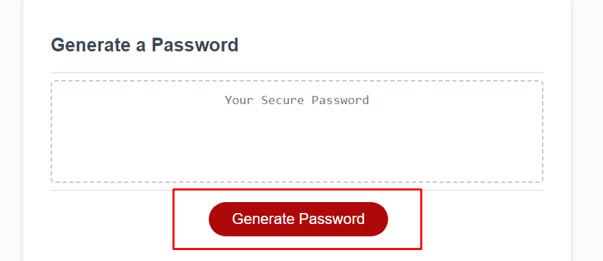
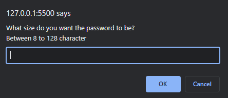
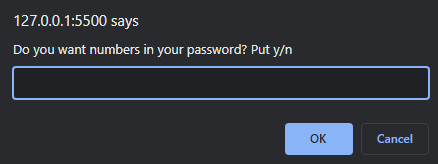
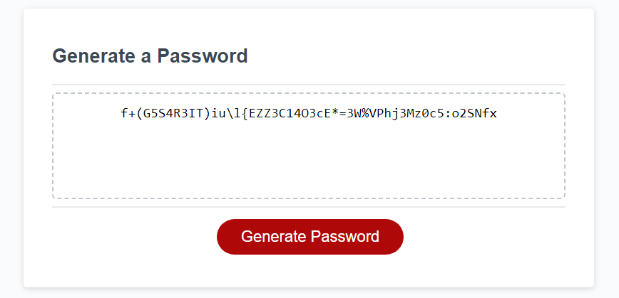

# Javascript-Password-Generator-week-3

**Making a password generator based on criteria that the user selects**

# GitPages

[Password Generator Page](https://amillsy.github.io/Javascript-Password-Generator-week-3/)


## User Story

```
AS AN employee with access to sensitive data
I WANT to randomly generate a password that meets certain criteria
SO THAT I can create a strong password that provides greater security
```

## Acceptance Criteria

```
GIVEN I need a new, secure password
WHEN I click the button to generate a password
THEN I am presented with a series of prompts for password criteria
WHEN prompted for password criteria
THEN I select which criteria to include in the password
WHEN prompted for the length of the password
THEN I choose a length of at least 8 characters and no more than 128 characters
WHEN asked for character types to include in the password
THEN I confirm whether or not to include lowercase, uppercase, numeric, and/or special characters
WHEN I answer each prompt
THEN my input should be validated and at least one character type should be selected
WHEN all prompts are answered
THEN a password is generated that matches the selected criteria
WHEN the password is generated
THEN the password is either displayed in an alert or written to the page
```

# What I learnt

I learnt how to use prompts in javascript to change the interaction on the website with the use of variables and if statements. With these statements, I can direct my code to do what I want. 

In addition, I can understand how to use functions so that I don't have to write the same sections over and over again. At the same as writing functions, it helped me understand the DRY principle of never having code that repeats itself, so running by this standard I tried to put all my functionality into different functions that could be reused.

## Usage

This website can generate passwords up to 128 characters and also the user to pick which type of character they want in their password.

### Password Generator

The first step is the user will click on the generate password button.



Then, it will prompt the user with 5 options:

#### Password Size


#### Numbers in the password


#### Lowercase character in the password


#### Uppercase Characters in the password


#### Special Characters in the password


### Password Generated

After they complete these prompts, the user will be given a password with the criterias that they asked for.




